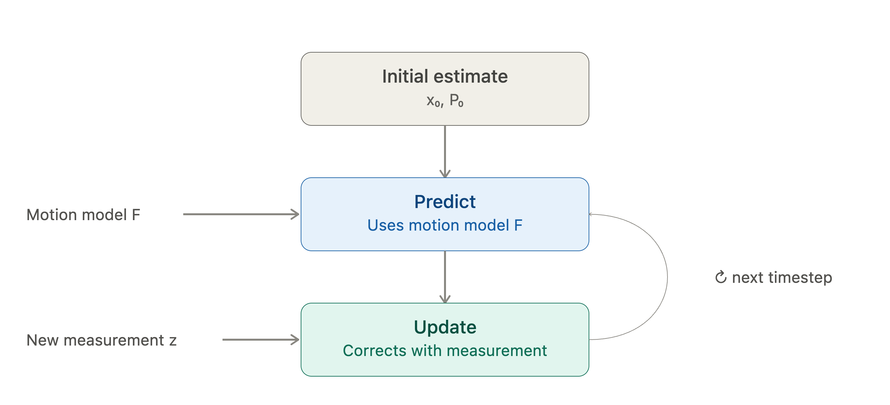
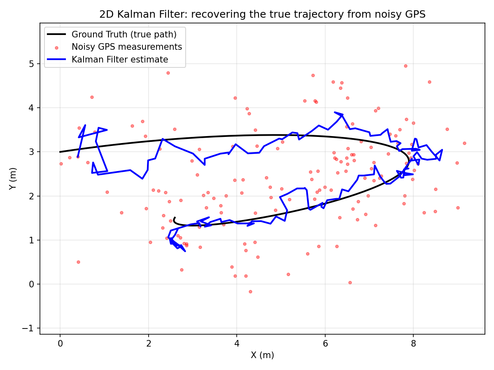

# Kalman Filter Demo

This project is a minimal interactive 2D Kalman Filter demonstration in Python.
It simulates a robot moving along a curved path, adds noisy GPS-like
measurements, and uses a Kalman Filter to recover a smoother estimate of the
true trajectory.

## Project Structure

```text
.
├── main.py
├── README.md
├── requirements.txt
├── kalman_filter_predict_update_loop.png
└── results/
    └── kalman_filter_demo.png
```

## How It Works

The demo uses a state vector with position and velocity:

```text
x = [px, py, vx, vy]^T
```

- `px, py` are the 2D position coordinates.
- `vx, vy` are the 2D velocity components.
- The motion model assumes approximately constant velocity.
- The measurement model only observes position, similar to GPS.

A Kalman Filter runs in two repeated steps:

1. **Predict**: estimate the next state using the motion model.
2. **Update**: correct the prediction using the newest noisy measurement.



The filter balances two sources of information: the predicted motion and the
sensor measurement. When the GPS readings are noisy, the Kalman estimate is
usually smoother and closer to the true path than the raw measurements.

## Installation

Create and activate a virtual environment:

```bash
python3 -m venv .venv
source .venv/bin/activate
```

Install the required packages:

```bash
pip install -r requirements.txt
```

## Run the Demo

```bash
python main.py
```

This opens a local matplotlib window with the trajectory plot and a control bar
underneath it.

## Demo

When you run the Python script, the matplotlib window shows the Kalman Filter
trajectory result and the interactive controls:



The black curve is the true trajectory, the red points are noisy GPS
measurements, and the blue curve is the Kalman Filter estimate. The title shows
the current GPS RMSE, Kalman Filter RMSE, and error reduction.

## Control Bar

The control bar lets you change the filter behavior without restarting the
program:

- `GPS noise (R)`: changes the simulated GPS measurement noise. Higher values
  make the red GPS points more scattered.
- `Process noise (Q)`: changes how much uncertainty the filter assigns to the
  motion model. Higher values make the blue estimate respond more quickly to
  measurements.
- `Regenerate`: draws a fresh batch of random GPS noise using the current slider
  values.

The chart title updates after each change with the raw GPS RMSE, Kalman Filter
RMSE, and error reduction.
